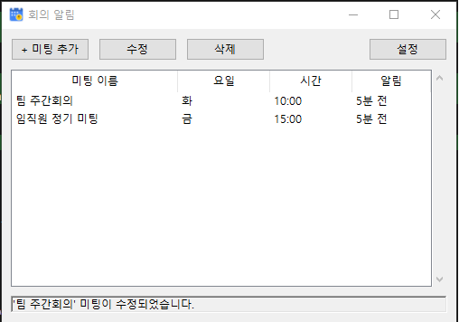
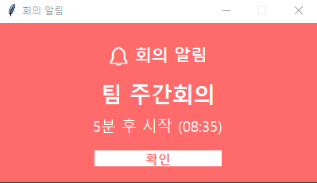

# 회의 알림 (Meeting Alarm)

Windows용 회의 알림 프로그램입니다. 매주 반복 또는 1회 알림을 지원합니다.

## 다운로드

[MeetingAlarm_Setup.exe 다운로드](https://github.com/insung4u/meeting-alarm/releases/latest/download/MeetingAlarm_Setup.exe)

> 설치 시 "Windows의 PC 보호" 경고가 나타나면 "추가 정보" → "실행"을 클릭하세요.

## 스크린샷





## 주요 기능

- **미팅 관리**: 미팅 이름, 요일(다중 선택), 시간, 알림 시간 설정
- **반복/1회 선택**: 매주 반복 또는 1회 알림 선택 가능
- **완료 표시**: 1회 알림 완료된 미팅은 취소선 + 회색 글씨로 표시
- **최상단 알림**: 다른 프로그램 위에 팝업으로 알림 표시
- **시스템 트레이**: 백그라운드 실행, 트레이 아이콘으로 관리
- **자동 시작**: Windows 시작 시 자동 실행 옵션

## 설치 및 실행

### Python 설치 (필수)

Python이 설치되어 있지 않다면 먼저 설치해야 합니다.

1. [Python 공식 사이트](https://www.python.org/downloads/)에서 Python 다운로드 (3.9 이상 권장, 최신 버전 사용 가능)
2. 설치 프로그램 실행
3. **중요**: 설치 첫 화면에서 **"Add Python to PATH"** 반드시 체크
4. "Install Now" 클릭하여 설치 완료
5. 설치 후 터미널(명령 프롬프트) 재시작

설치 확인:
```bash
python --version
```

> **문제 해결**: `Python was not found` 오류가 나오면:
> - Windows 설정 → 앱 → 앱 실행 별칭 → "python.exe" 끄기
> - 또는 `py --version` 명령어 사용 (이후 모든 `python` 명령을 `py`로 대체)

### 개발 환경에서 실행

1. 의존성 설치:
```bash
python -m pip install -r requirements.txt
```

2. 아이콘 생성 (선택사항):
```bash
python create_icon.py
```

3. 실행:
```bash
python src/main.py
```

### 빌드 (exe 생성)

```bash
python build.py
```

빌드 완료 후 `dist/MeetingAlarm.exe` 파일이 생성됩니다.

### 설치 프로그램 생성

1. [Inno Setup](https://jrsoftware.org/isinfo.php) 설치
2. 아래 명령어 실행 (Inno Setup 설치 경로에 따라 조정):
```powershell
& 'C:\Users\<사용자명>\AppData\Local\Programs\Inno Setup 6\ISCC.exe' installer/setup.iss
```
3. `dist/installer/MeetingAlarm_Setup.exe` 파일 생성됨

## 사용 방법

1. **미팅 추가**: "미팅 추가" 버튼 클릭 후 이름, 요일, 시간, 알림 시간 입력
   - **매주 반복** 체크: 매주 해당 요일마다 반복 알림
   - **매주 반복** 해제: 다음 1번만 알림 후 자동 완료 처리
2. **미팅 수정**: 목록에서 미팅 선택 후 "수정" 버튼 또는 더블클릭
3. **미팅 삭제**: 목록에서 미팅 선택 후 "삭제" 버튼
4. **설정**: 알림 소리, 기본 알림 시간, 자동 시작 설정 / 현재 버전 확인
5. **트레이**: 창 닫기 버튼 클릭 시 트레이로 최소화, 더블클릭으로 다시 열기

## 데이터 저장 위치

- Windows: `%APPDATA%\MeetingAlarm\`
  - `meetings.json`: 미팅 목록
  - `settings.json`: 설정

## 버전 히스토리

### v1.0.1
- 미팅 추가/수정 시 매주 반복 여부 체크박스 추가
- 1회 알림 완료된 미팅에 취소선 + 회색 글씨 표시
- 미팅 목록에 반복 여부 컬럼 추가 ("매주" / "1회")
- 설정 창에 현재 버전 표시

### v1.0.0
- 최초 릴리즈

## 기술 스택

- Python 3.x
- tkinter (GUI)
- pystray (시스템 트레이)
- Pillow (이미지 처리)
- PyInstaller (exe 빌드)
- Inno Setup (설치 프로그램)
